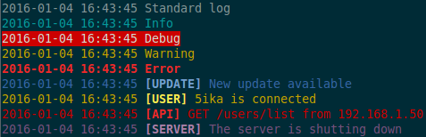

# Installation

```bash
npm install slogg
```

# Utilisation
Il y a deux manières d'utiliser Slogg.

## Avec le fichier slogg.js
Cette manière permet de définir des contextes dans un fichier _slogg.json_ à placer dans le dossier racine du projet. Le fichier _slogg.json_ doit respecter la structure suivante :

```json
[
  {
    "name": "Nom du contexte",
    "color": "Une couleur parmis ['red', 'green', 'yellow', 'blue', 'magenta', 'cyan', 'white', 'gray', 'black']",
    "prefix": "Chaîne de caractères qui préfixera les messages correspondant au contexte"
  },
  ...
]
```

Un exemple est disponible dans le fichier _slogg.example.js_ :

```bash
mv node_modules/slogg/slogg.examples.js ./slogg.example.js
```

Il est ensuite possible d'utiliser les contextes de la manière suivante :

```javascript
var slogg = require('slogg')();

slogg.update('New update available');
slogg.user('5ika is connected');
slogg.api('GET /users/list from 192.168.1.50');
```

Par défaut, les contextes standards sont disponibles :

```javascript
slogg.log('Standard log');
slogg.info("Info");
slogg.debug('Debug');
slogg.warn('Warning');
slogg.error('Error');
```

Il est cependant possible de les ré-écrire à partir du fichier _slogg.json_.

## Avec un contexte pour tout le module
Si un module correspond à un seul contexte, il est possible de fixer un contexte pour l'ensemble du module. Dans ce cas, le fichier _slogg.js_ n'est pas utilisé.

```javascript
var slogg = require('slogg')('MonContexte', 'cyan');

slogg("J'apprecie les fruits au sirop");
```

# Exemple
Un exemple d'utilisation se trouve dans le fichier _example.js_.

```bash
node example
```


